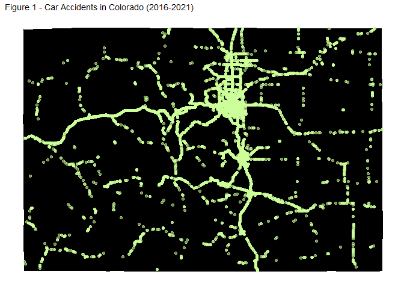
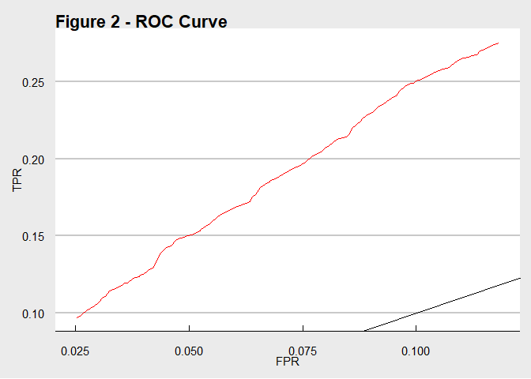
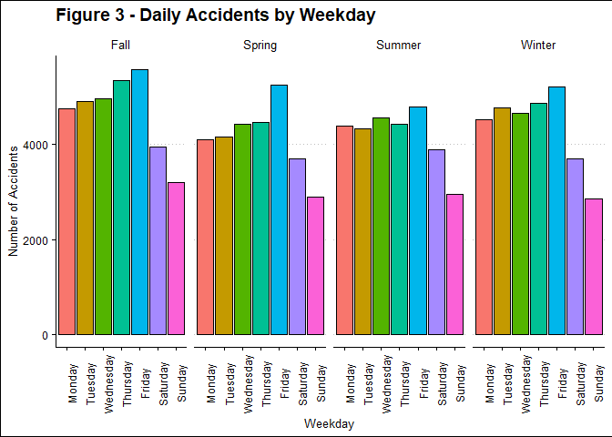

## Abstract

Automobile accidents are of key concern to many policymakers throughout
the country. They should be minimized when possible to prevent
substantial economic and social harm. Furthermore, predicting severity
can help allocate resources when responding to car accidents. Focused on
the state of Colorado, the goal of the following study was to build
models predicting the number of car accidents in an area along with the
severity of an individual accident. Using data gathered from the
Colorado Department of Transportation, this study takes information of
over 120,000 auto accidents that took place in the year 2019. This was
then used to try and predict, given certain factors, how many accidents
will result in injury. The model used in making these predictions was a
binomial logistic model using Lasso regularization. With an
approximately 79% success rate, this model was marginally better at
predicting injury than a model that chose to only predict no injury
(approximately 77% of accidents in our test resulted in no injury).
Despite this, the coefficients extracted from the model show intuitive
factors that can cause injury. In addition to this, another data set was
used, gathered from a public data set on Kaggle.com, containing accident
counts and different weather conditions for the day. This set was used
in conjunction to the other to build a Gradient Boosted Forests model
aimed at predicting the number of accidents per 100,000 people for a
particular day in specific counties. This model was able to predict with
decent accuracy the number of out-of-sample accidents that would happen
in a day given particular weather factors.

## Introduction

The plot above shows us a sample of 25,340 automobile accidents that
have occurred in the state of Colorado. At this level, we can see city
centers outlined by highways and interstates where traffic is dense and
car accidents are common. Behind each of these accidents are costs
ranging from minor property damage to the unfortunate loss of life. The
essence of the following analysis will be to determine factors that may
have contributed to these accidents and their severity, as well as gauge
where and when accidents will occur given certain circumstances. The
variables of interest will include weather conditions, location, time of
day, and roadway characteristics. By looking at these relationships the
hope is to give resources to policy makers and first-responders. If
severity can be predicted by characteristics, particularly those that
can be reported on a 911 call, EMTs may be able to better gauge the
situation they are heading into. Furthermore, if the number of accidents
can be predicted given certain weather conditions and times of the year,
policymakers may be able to allocate funds appropriately to areas that
may need the most relief. If predictions like these are accurate, it
could potentially guide policy in a way that improves safety for
Colorado drivers.

## Methods and Data

There are three data sets used in conjunction for this study. The first
comes from the Colorado Department of Transportation. This data is a
record of automobile accidents in the state of Colorado for the year
2019. It includes over 120,000 events with several variables of
interest. Dates and times are reported as well as location information
providing names of the counties and streets the events took place.
Furthermore, there are several variables describing road conditions
leading up to an event. These include road type (highway/interstate/city
street/urban/rural), weather statuses (Icy/Dry/Wet), proximity to
intersections, speed limits (mph), road lighting
(Daylight/Dark-unlighted, Dark-lighted), and road contour (Level vs
Hilltop). There are also features describing driver traits such as age
(coded 1 for teen, 0 for adult), speed at time of accident (mph),
inebriation status (coded 1 for intoxicated, 0 if not), driver behavior
prior to the accident (i.e. asleep at the wheel, weaving, changing
lanes), and what type of vehicle they were driving (coded 1 for
motorcycle, 0 if not). Two other key variable of interest will be the
severity of the accident (coded 0 for no injury and 1 for
injury/fatality) and the most harmful event (head-on collision, running
into a deer, etc).

This data was used to build a binomial logistic regression model using
Lasso regularization. This specification was used to predict whether an
accident would be classified as non-severe (no injury) or severe (injury
or fatality). Lasso regularization was employed to quickly select the
features to be used in the regression as there are many in the data
used. The outcome variable was regressed on several factors. These
included the type of road the accident occurred on (county road vs state
highway), the number of vehicles involved in the accident, the condition
of the roadway(dry vs icy vs wet), the most harmful event (head-on
collision, sideswipe, tree, etc), the speed limit in the area, the speed
of the fastest car involved, and driver characteristics(teen, driving
motorcycle, impairment status, and if they were wearing a seat belt).
This model was trained on 80% of the data using cross validation and
then was tested on the remaining 20%. A confusion matrix was then
constructed to determine the out-of-sample accuracy. This number was
then compared to a model that predicted no-injury for all accidents as a
baseline.

Our other data set comes from real-time traffic information collected by
researchers Sobhan Moosavi, Mohammad Hossein Samavatican, Srinivasan
Parthasarathy, and Rajiv Ramnath. This information was collected by
scraping multiple APIs that provide live information on new traffic
incidents in the United States. The researchers have made this data
publicly available on Kaggle.com to aid the research community in
traffic accident analysis. The data set contains nearly three million
observations of traffic accidents in the United States between the years
2016-2021. This information includes similar metrics as the previous;
however, this data set has latitudinal and longitudinal coordinates as
well as more detailed weather information associated with each
observation. For this reason, certain visualizations were constructed
using this data set and it was helpful in aggregating county-level
weather data. Due to its large file size the csv was filtered separately
for instances that occurred in Colorado then saved into a new file.

To aggregate county level data, first counts of accidents were taken
from the first data set grouped by date and county. This number was then
divided by the total population in each county (given by Colorado’s
Information Marketplace; the third data set) and multiplied by 100,000
to get a population adjusted rate of accidents. Then, using the Kaggle
data set, averages of temperatures, wind speeds, precipitation, and
visibility were taken for particular dates in different counties. From
here, a gradient boosted trees model was constructed. The interaction
depth was chosen to be 10 and the optimal number of trees used was
selected through cross validation of 10 folds. This model was trained on
80% of the county level data and then was tested on the remaining 20%.
Then, the root mean squared error was taken from the models prediction
on the out-of-sample outcomes that were in the testing set.

## Results

### Predicting Severity using Lasso Regression

Below displays the results for classifying severity using our
regularized binomial logistic model. The ROC curve displayed in Figure 2
shows the relationship between the true positive rate and false positive
rate when changing the threshold of how we classify injury based on our
regression predictions. We can see that it moves almost linearly,
contrasting an ideal ROC curve that bows out to the upper left. Since
the scale of the axes are so small, our model does not seem to be
predicting many injuries for any threshold value. For this reason, our
threshold is set at a very low number (nearly 0) to coerce predictions
for injury into our confusion matrix (table 1). With this threshold we
had a TPR of only 6% and a FPR of 1%.

<table>
<caption>
Confusion Matrix
</caption>
<thead>
<tr>
<th style="text-align:left;">
</th>
<th style="text-align:right;">
Predicted No Injury
</th>
<th style="text-align:right;">
Predicted Injury
</th>
</tr>
</thead>
<tbody>
<tr>
<td style="text-align:left;">
Actual No Injury
</td>
<td style="text-align:right;">
9972
</td>
<td style="text-align:right;">
1352
</td>
</tr>
<tr>
<td style="text-align:left;">
Actual Injury
</td>
<td style="text-align:right;">
2340
</td>
<td style="text-align:right;">
893
</td>
</tr>
</tbody>
</table>

Despite our low TPR, it is interesting to note some of the coefficients
that had high positive values from our regression. Many of the top
coefficients were associated with speed variables. Unsurprisingly, high
speeds had higher rankings in our model. Outside of these, Table 2 shows
some of the coefficients that had high positive impact on the
classification of injury/fatality. Anything with “mhe” as a prefix means
this was the “most harmful event” in the accident. We can see that
bicycle, pedestrian, and head-on collisions are ranked highly, as well
as incidences where the vehicle overturned. Additionally, the term
“vehicles” signifies the number of vehicles involved in an accident. Its
ranking shows that with more vehicles involved, injury risk is higher.
The table also shows that if a motorcycle was involved in an accident,
or if a driver was inebriated, the risk of injury was higher. Finally,
the driver factor of “illness” ranked higher than any other factor of
this kind.

<table>
<caption>
Notable Coefficients
</caption>
<thead>
<tr>
<th style="text-align:left;">
term
</th>
<th style="text-align:right;">
estimate
</th>
</tr>
</thead>
<tbody>
<tr>
<td style="text-align:left;">
mhePEDESTRIAN
</td>
<td style="text-align:right;">
2.8542362
</td>
</tr>
<tr>
<td style="text-align:left;">
mheBICYCLE
</td>
<td style="text-align:right;">
2.4278453
</td>
</tr>
<tr>
<td style="text-align:left;">
motorcycle1
</td>
<td style="text-align:right;">
2.2660509
</td>
</tr>
<tr>
<td style="text-align:left;">
factor\_1ILLNESS
</td>
<td style="text-align:right;">
0.7677800
</td>
</tr>
<tr>
<td style="text-align:left;">
mheHEAD-ON
</td>
<td style="text-align:right;">
0.7060971
</td>
</tr>
<tr>
<td style="text-align:left;">
mheOVERTURNING
</td>
<td style="text-align:right;">
0.6478922
</td>
</tr>
<tr>
<td style="text-align:left;">
vehicles
</td>
<td style="text-align:right;">
0.6259418
</td>
</tr>
<tr>
<td style="text-align:left;">
impairment1
</td>
<td style="text-align:right;">
0.5308407
</td>
</tr>
</tbody>
</table>

### Accident Count Predictions using Gradient Boosted Forests

Our next model aims to predict the counts of motor vehicle accidents in
each county given different weather conditions. Also included in the
model are variables for day of the week and the season. Figure 3 depicts
that weekdays have far more accidents than weekends, Friday being the
day with the most accidents. Moreover, Fall appears to have more
accidents than any other season:

When controlling for the above factors in our model, our out-of-sample
performance reported an rmse of approximately 1.481. To give context
Table-3 shows the summary statistics for accident rates in Colorado by
county. For many counties in our data set, this is within one standard
deviation from the mean.

<table>
<caption>
Mean and Standard Deviation of Event Rates by County
</caption>
<thead>
<tr>
<th style="text-align:left;">
County
</th>
<th style="text-align:right;">
Mean
</th>
<th style="text-align:right;">
Standard Deviation
</th>
</tr>
</thead>
<tbody>
<tr>
<td style="text-align:left;">
ADAMS
</td>
<td style="text-align:right;">
2.739392
</td>
<td style="text-align:right;">
0.9690365
</td>
</tr>
<tr>
<td style="text-align:left;">
ARAPAHOE
</td>
<td style="text-align:right;">
2.981216
</td>
<td style="text-align:right;">
0.9655146
</td>
</tr>
<tr>
<td style="text-align:left;">
BOULDER
</td>
<td style="text-align:right;">
2.149033
</td>
<td style="text-align:right;">
1.0934074
</td>
</tr>
<tr>
<td style="text-align:left;">
BROOMFIELD
</td>
<td style="text-align:right;">
5.143932
</td>
<td style="text-align:right;">
2.6852261
</td>
</tr>
<tr>
<td style="text-align:left;">
CHAFFEE
</td>
<td style="text-align:right;">
5.156766
</td>
<td style="text-align:right;">
0.0000000
</td>
</tr>
<tr>
<td style="text-align:left;">
CLEAR CREEK
</td>
<td style="text-align:right;">
13.150241
</td>
<td style="text-align:right;">
4.6355367
</td>
</tr>
<tr>
<td style="text-align:left;">
DENVER
</td>
<td style="text-align:right;">
5.091360
</td>
<td style="text-align:right;">
1.4658893
</td>
</tr>
<tr>
<td style="text-align:left;">
DOUGLAS
</td>
<td style="text-align:right;">
1.187014
</td>
<td style="text-align:right;">
0.6056770
</td>
</tr>
<tr>
<td style="text-align:left;">
EAGLE
</td>
<td style="text-align:right;">
3.901871
</td>
<td style="text-align:right;">
2.2723375
</td>
</tr>
<tr>
<td style="text-align:left;">
EL PASO
</td>
<td style="text-align:right;">
2.081259
</td>
<td style="text-align:right;">
0.7653911
</td>
</tr>
<tr>
<td style="text-align:left;">
ELBERT
</td>
<td style="text-align:right;">
7.791803
</td>
<td style="text-align:right;">
0.0000000
</td>
</tr>
<tr>
<td style="text-align:left;">
FREMONT
</td>
<td style="text-align:right;">
3.543230
</td>
<td style="text-align:right;">
1.7060483
</td>
</tr>
<tr>
<td style="text-align:left;">
GARFIELD
</td>
<td style="text-align:right;">
3.302564
</td>
<td style="text-align:right;">
2.1844411
</td>
</tr>
<tr>
<td style="text-align:left;">
GRAND
</td>
<td style="text-align:right;">
6.490977
</td>
<td style="text-align:right;">
0.0000000
</td>
</tr>
<tr>
<td style="text-align:left;">
HUERFANO
</td>
<td style="text-align:right;">
14.757969
</td>
<td style="text-align:right;">
0.0000000
</td>
</tr>
<tr>
<td style="text-align:left;">
JEFFERSON
</td>
<td style="text-align:right;">
2.115176
</td>
<td style="text-align:right;">
0.7847556
</td>
</tr>
<tr>
<td style="text-align:left;">
LARIMER
</td>
<td style="text-align:right;">
1.731590
</td>
<td style="text-align:right;">
0.8677125
</td>
</tr>
<tr>
<td style="text-align:left;">
LAS ANIMAS
</td>
<td style="text-align:right;">
9.456463
</td>
<td style="text-align:right;">
5.2448275
</td>
</tr>
<tr>
<td style="text-align:left;">
LOGAN
</td>
<td style="text-align:right;">
11.624122
</td>
<td style="text-align:right;">
3.2877983
</td>
</tr>
<tr>
<td style="text-align:left;">
MESA
</td>
<td style="text-align:right;">
2.540908
</td>
<td style="text-align:right;">
1.4500660
</td>
</tr>
<tr>
<td style="text-align:left;">
MONTROSE
</td>
<td style="text-align:right;">
4.117356
</td>
<td style="text-align:right;">
1.1763875
</td>
</tr>
<tr>
<td style="text-align:left;">
MORGAN
</td>
<td style="text-align:right;">
5.339863
</td>
<td style="text-align:right;">
3.0274179
</td>
</tr>
<tr>
<td style="text-align:left;">
PUEBLO
</td>
<td style="text-align:right;">
3.878416
</td>
<td style="text-align:right;">
1.8178246
</td>
</tr>
<tr>
<td style="text-align:left;">
ROUTT
</td>
<td style="text-align:right;">
5.098295
</td>
<td style="text-align:right;">
2.0393181
</td>
</tr>
<tr>
<td style="text-align:left;">
SUMMIT
</td>
<td style="text-align:right;">
5.224846
</td>
<td style="text-align:right;">
3.0993312
</td>
</tr>
<tr>
<td style="text-align:left;">
WASHINGTON
</td>
<td style="text-align:right;">
20.725389
</td>
<td style="text-align:right;">
0.0000000
</td>
</tr>
<tr>
<td style="text-align:left;">
WELD
</td>
<td style="text-align:right;">
2.909110
</td>
<td style="text-align:right;">
1.3048921
</td>
</tr>
</tbody>
</table>

Using this model we can make some predictions about new data. Say, in
Denver County, the average temperature for a particular Friday in the
Fall is 10 degrees. We expect it to snow on average .1 inches across the
county and the average wind speed is 20 mph. Our model predicts
approximately 3.496 accidents per 100,000 people. Considering the
county’s population of 710137, this equates to roughly 25 accidents in
the county on that day.

## Conclusion

Determinately, the models above give us mixed results when analyzing
motor vehicle accidents in Colorado. Our regularized logistical model
showed weakness in determining the severity of car accidents. The shape
of our ROC curve suggests that our model have very little predictive
power. Moreover, a TPR of only 6% when classifying injury/fatality would
not give first-responders a good gauge as to how severe an accident
would be given particular characteristics. However, the coefficients
that the Lasso regularization process gave us could be useful in
identifying key causes of harm. Higher speeds were associated with
greater injury risk. Accidents that involved someone not in an enclosed
vehicle (pedestrian, bicycle, or motorcycle) were associated with higher
accident severity. Moreover, if the wreck was a head-on collision or if
the vehicle rolled, risk of injury increased. The variable of driver
illness may suggest that the driver’s illness caused them to wreck,
causing more injury to themselves and potentially others. These could be
factors that first-responders could use to anticipate greater aid for
accidents of this type.

When predicting the number of the number of accidents on a given day,
our gradient boosted forests model seemed to preform well. With an
out-of-sample rmse score of approximately 1.48, many of our predictions
were quite accurate. This model tended to predict higher values in the
Winter and Fall and when temperatures were low. This is an intuitive
result as road conditions tend to be worse during these times.
Additionally, higher values were associated with Fridays. Weekdays, in
general, had higher accidents than weekends, but perhaps Fridays are
associated with greater instances of drunk driving or greater traffic
flows due to travel for the weekend. Ultimately, this model has
potential to be used in the future. Given particular weather forecasts,
a county may be able to predict how many accidents will happen within
their boarders. This could give policymakers insights as to how to make
roads safer at particular times and where to allocate resources.

Considering all of this, there is certainly room for expansion in this
analysis. Different classification models could be engineered to provide
a better result than the regularized model used in this study. Perhaps
better weather data could be gathered from state-run weather stations.
Additionally, this analysis could be expanded to the national level. It
could be useful to see how state infrastructure spending impacts traffic
accidents. Ultimately, motor vehicle accidents are of key concern to
those influencing policy, behooving them to study where they may occur
and how severe they can be.

## Resources

Original Data Sets:

<https://www.kaggle.com/datasets/sobhanmoosavi/us-accidents>

<https://www.codot.gov/safety/traffic-safety/data-analysis/crash-data>

<https://data.colorado.gov/Demographics/Total-Population-by-County-by-Year-Line-Chart/nuaj-mcig>
